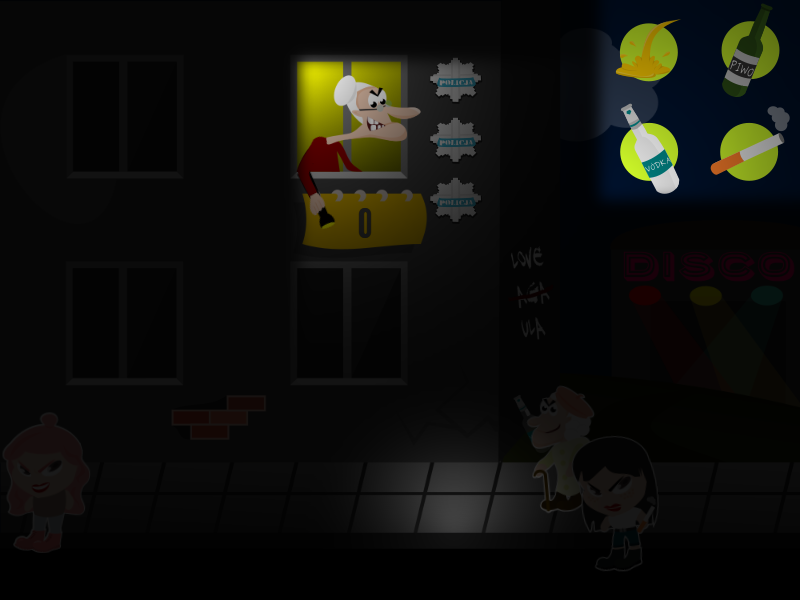
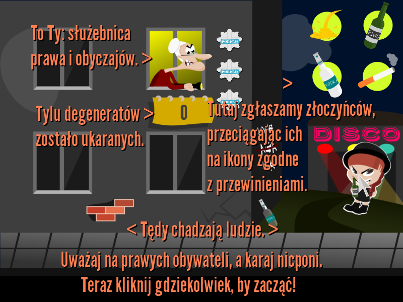

# East Games United game jam

#### Do not let the partygoers disturb your sleep!

Spy on your neighbors. Report any wrongdoings. Drag and drop criminals to the correct category to make them pay for their crimes!

**Note**: all texts and sounds in the game are in Polish. Still, the game is pretty simple and should be easy enough to follow.

### About

Created in under 30 hours using [KTX](https://github.com/czyzby/ktx) during the [East Games United](https://www.facebook.com/EastGamesUnited/) game jam by a Java backend developer and a cute graphics designer. The jam's topic was _"śledź"_ (_"herring"_ or _"to spy"_) and this _one_ of the games that we came up. The other one is [here](https://github.com/czyzby/egu2016). Since "śledź" also stands for "to spy" in Polish, we went for a game were you are a grandpa _spying_ on people.

- Coding: [@czyzby](https://github.com/czyzby)
- Idea, sounds: [@grafiszti](https://github.com/grafiszti)
- Graphics: [@marsza](https://github.com/marszaa)

**Note**: we were desperate and sleep deprived. This ain't your Uncle Bob coding exercise. Don't judge me by this code.

## Gradle

This project uses [Gradle](http://gradle.org/) to manage dependencies. Gradle wrapper was included, so you can run Gradle tasks using `gradlew.bat` or `./gradlew` commands. Useful Gradle tasks and flags:

- `--continue`: when using this flag, errors will not stop the tasks from running.
- `--daemon`: thanks to this flag, Gradle daemon will be used to run chosen tasks.
- `--offline`: when using this flag, cached dependency archives will be used.
- `--refresh-dependencies`: this flag forces validation of all dependencies. Useful for snapshot versions.
- `build`: builds sources and archives of every project.
- `cleanEclipse`: removes Eclipse project data.
- `cleanIdea`: removes IntelliJ project data.
- `clean`: removes `build` folders, which store compiled classes and built archives.
- `desktop:jar`: builds application's runnable jar, which can be found at `desktop/build/libs`.
- `desktop:run`: starts the application.
- `eclipse`: generates Eclipse project data.
- `idea`: generates IntelliJ project data.
- `pack`: packs GUI assets from `raw/ui`. Saves the atlas file at `assets/ui`.
- `test`: runs unit tests (if any).

Note that most tasks that are not specific to a single project can be run with `name:` prefix, where the `name` should be replaced with the ID of a specific project.
For example, `core:clean` removes `build` folder only from the `core` project.
